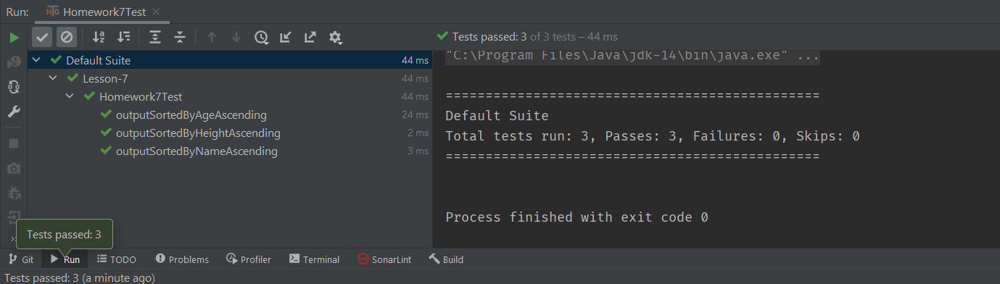

# Data Structures and Algorithms in Java (CSE-41321)
## University of California San Diego Extension
## Summer 2021 (157162)
## Raymond Mitchell III (Instructor)
## Assignment #7
### Heaps
### Problem Statement
Implement a method called *outputSorted* which utilizes a **Heap** to sort an array of **Person** objects. An object of
type **Person** is defined as follows:
```java
class Person {
    String name;
    int age;
    double height;
}
```
The *outputSorted* method expects two arguments; an array of **Person** objects, and a **Comparator**.
```java
    outputSorted(Person[] person, Comparator<Person> comparator)
```
It uses the **Comparator** parameter to insert the **Person** objects into a **Heap** in the prescribed order. Then 
it extracts the **Person** objects from the **Heap** and lists them on the console. The original array of **Person** 
objects is not modified.

The _outputSorted_ method must be able to display the contents of an array of **Person** objects in order by _name_, 
_age_ or _height_.
### Implementation
The first thing I decided was that the **Person** class needed a little sprucing up. Toward that end, I added 
accessor and mutator methods, as well as a *toString* method. The result was as follows:
```java
static class Person {
    private String name;
    private int age;
    private double height;

    public Person(String name, int age, double height) {
        this.name = name;
        this.age = age;
        this.height = height;
    }

    public String getName() {
        return name;
    }

    public void setName(String name) {
        this.name = name;
    }

    public int getAge() {
        return age;
    }

    public void setAge(int age) {
        this.age = age;
    }

    public double getHeight() {
        return height;
    }

    public void setHeight(double height) {
        this.height = height;
    }

    @Override
    public String toString() {
        return "Person{" +
                "name='" + name + '\'' +
                ", age=" + age +
                ", height=" + height +
                '}';
    }
}

```
Probably a bit of overkill for this exercise, but I definitely needed the constructor, accessor and *toString* methods.

Next, I implemented the *outputSorted* method. It was fairly straightforward, and was composed of only a few lines:
```java
public static void outputSorted(Person[] people, Comparator<Person> comparator) {
    Heap<Person> heap = new Heap<>(comparator);
    for (Person person : people) heap.insert(person);
    while (!heap.isEmpty()) {
        System.out.println(heap.extract());
    }
}

```
Next I created a suite of unit tests. Once again I elected to use the TestNG framework. Conspicuously absent from the
suite were any tests of the **Person** class's methods!? I'm not sure what happened there.
```java
    @Test
    public void outputSortedByNameAscending() {
        Homework7.outputSorted(people,
                new Comparator<Homework7.Person>() {
                    @Override
                    public int compare(Homework7.Person p1, Homework7.Person p2) {
                        return p2.getName().compareTo(p1.getName());
                    }
                });
        assertTrue(this.consoleContent.toString().contains(alphabeticalOrderByName));
    }

    @Test
    public void outputSortedByAgeAscending() {
        Homework7.outputSorted(people,
                new Comparator<>() {
                    public int compare(Homework7.Person p1, Homework7.Person p2) {
                        return p2.getAge() - p1.getAge();
                    }
                });
        assertTrue(this.consoleContent.toString().contains(ascendingOrderByAge));
    }

    @Test
    public void outputSortedByHeightAscending() {
        Homework7.outputSorted(people,
                new Comparator<>() {
                    public int compare(Homework7.Person p1, Homework7.Person p2) {
                        if (p1.getHeight() < p2.getHeight()) {
                            return 1;
                        } else if (p1.getHeight() > p2.getHeight()) {
                            return -1;
                        }
                        return 0;
                    }
                });
        assertTrue(this.consoleContent.toString().contains(ascendingOrderByHeight));
    }
}

```
It was during development of the unit tests that I established the convention of passing the second argument of the 
*outputSorted* method as an anonymous inner class. I hope I'm correctly identifying that construct. Anyway, whatever 
it is, it stuck.

It is the **Comparator** that controls the behavior of the *outputSorted* method (i.e., the sort order). However, I
noticed that the algorithms I developed for the *compare* method seemed counterintuitive. The logic seemed inverted.
Considering how a heap works, I guess it makes sense.

To provide a user interface, I created the **Driver** class. The **Driver** class contains a *main* method which 
calls the *outputSorted* method several times to sort an array of **Person** objects either by name, age or height.
```java
    public static class Driver {

        public static void main(String[] arguments) {
            Person[] people = new Person[9]; // A 9-element array of Person objects
            people[0] = new Homework7.Person("Karsten", 25, 74);
            people[1] = new Homework7.Person("Dalilah", 31, 68);
            people[2] = new Homework7.Person("Andre", 26, 70);
            people[3] = new Homework7.Person("Mary", 66, 68);
            people[4] = new Homework7.Person("Grant", 23, 74);
            people[5] = new Homework7.Person("Simone", 24, 56);
            people[6] = new Homework7.Person("Gabrielle", 24, 70);
            people[7] = new Homework7.Person("Kathryn", 30, 68);
            people[8] = new Homework7.Person("Femke", 21, 72);
            System.out.println("\n… sorted by name:\n");
            outputSorted(people,
                    new Comparator<>() {
                        @Override
                        public int compare(Homework7.Person thisPerson, Homework7.Person thatPerson) {
                            return thatPerson.getName().compareTo(thisPerson.getName());
                        }
                    });
            System.out.println("\n… sorted by age:\n");
            outputSorted(people,
                    new Comparator<>() {
                        @Override
                        public int compare(Homework7.Person thisPerson, Homework7.Person thatPerson) {
                            return thatPerson.getAge() - thisPerson.getAge();
                        }
                    });
            System.out.println("\n… sorted by height:\n");
            outputSorted(people,
                    new Comparator<>() {
                        @Override
                        public int compare(Person thisPerson, Person thatPerson) {
                            if (thisPerson.getHeight() < thatPerson.getHeight()) {
                                return 1;
                            } else if (thisPerson.getHeight() > thatPerson.getHeight()) {
                                return -1;
                            }
                            return 0;
                        }
                    });
        }
    }

```
### Deliverables
#### Homework7
```java
package cse41321.containers;

import java.util.Comparator;

public class Homework7 {

    static class Person {
        private String name;
        private int age;
        private double height;

        public Person(String name, int age, double height) {
            this.name = name;
            this.age = age;
            this.height = height;
        }

        public String getName() {
            return name;
        }

        public void setName(String name) {
            this.name = name;
        }

        public int getAge() {
            return age;
        }

        public void setAge(int age) {
            this.age = age;
        }

        public double getHeight() {
            return height;
        }

        public void setHeight(double height) {
            this.height = height;
        }

        @Override
        public String toString() {
            return "Person{" +
                    "name='" + name + '\'' +
                    ", age=" + age +
                    ", height=" + height +
                    '}';
        }
    }

    public static class Heap<E> {
        Object[] tree;  // Left-balanced binary tree

        private final Comparator<? super E> comparator;

        public Heap(Comparator<? super E> comparator) {
            this.comparator = comparator;
        }

        public int getSize() {
            return tree == null ? 0 : tree.length;
        }

        public boolean isEmpty() {
            return getSize() == 0;
        }

        @SuppressWarnings("unchecked")
        public void insert(E data) {
            // Grow tree by 1 to hold new node
            Object[] temp;
            if (tree == null) {
                temp = new Object[1];
            } else {
                temp = new Object[tree.length + 1];
                System.arraycopy(tree, 0, temp, 0, tree.length);
            }
            tree = temp;

            // Insert data as right-most node in last level
            tree[getSize() - 1] = data;

            // Push node upward to correct position
            int childIndex = getSize() - 1;
            int parentIndex = getParentIndex(childIndex);
            while (childIndex > 0
                    && comparator.compare(
                    (E) tree[parentIndex],
                    (E) tree[childIndex]) < 0) {
                // Parent and child out of order, swap
                swapNodes(parentIndex, childIndex);

                // Move up one level in the tree
                childIndex = parentIndex;
                parentIndex = getParentIndex(parentIndex);
            }
        }

        @SuppressWarnings("unchecked")
        public E extract() throws IllegalStateException {
            if (isEmpty()) {
                throw new IllegalStateException("Cannot extract from empty heap");
            }

            // Extract data at top of heap
            E extracted = (E) tree[0];

            // If extracting last node, set tree to empty and return extracted data
            if (getSize() == 1) {
                tree = null;
                return extracted;
            }

            // Save and remove right-most node from last level
            E save = (E) tree[tree.length - 1];
            Object[] temp = new Object[tree.length - 1];
            System.arraycopy(tree, 0, temp, 0, tree.length - 1);
            tree = temp;

            // Set saved node as the new root
            tree[0] = save;

            // Push root down to correct position
            int parentIndex = 0;
            while (true) {
                int leftChildIndex = getLeftChildIndex(parentIndex);
                int rightChildIndex = getRightChildIndex(parentIndex);

                // Determine whether parent, left child, or right child is largest
                int maxIndex = parentIndex;
                if (leftChildIndex < tree.length && comparator.compare(
                        (E) tree[leftChildIndex],
                        (E) tree[maxIndex]) > 0) {
                    maxIndex = leftChildIndex;
                }
                if (rightChildIndex < tree.length && comparator.compare(
                        (E) tree[rightChildIndex],
                        (E) tree[maxIndex]) > 0) {
                    maxIndex = rightChildIndex;
                }

                // If parent is largest, root has been pushed to correct position
                if (parentIndex == maxIndex) {
                    break;
                } else {
                    // Parent and a child out of order, swap with larger child
                    swapNodes(parentIndex, maxIndex);

                    // Move down one level in the tree
                    parentIndex = maxIndex;
                }
            }

            return extracted;
        }

        private static int getParentIndex(int childIndex) {
            return (childIndex - 1) / 2;
        }

        private static int getLeftChildIndex(int parentIndex) {
            return parentIndex * 2 + 1;
        }

        private static int getRightChildIndex(int parentIndex) {
            return parentIndex * 2 + 2;
        }

        private void swapNodes(int index1, int index2) {
            Object temp = tree[index1];
            tree[index1] = tree[index2];
            tree[index2] = temp;
        }


    }

    public static void outputSorted(Person[] people, Comparator<Person> comparator) {
        Heap<Person> heap = new Heap<>(comparator);
        for (Person person : people) heap.insert(person);
        while (!heap.isEmpty()) {
            System.out.println(heap.extract());
        }
    }

    public static class Driver {

        public static void main(String[] arguments) {
            Person[] people = new Person[9]; // A 9-element array of Person objects
            people[0] = new Homework7.Person("Karsten", 25, 74);
            people[1] = new Homework7.Person("Dalilah", 31, 68);
            people[2] = new Homework7.Person("Andre", 26, 70);
            people[3] = new Homework7.Person("Mary", 66, 68);
            people[4] = new Homework7.Person("Grant", 23, 74);
            people[5] = new Homework7.Person("Simone", 24, 56);
            people[6] = new Homework7.Person("Gabrielle", 24, 70);
            people[7] = new Homework7.Person("Kathryn", 30, 68);
            people[8] = new Homework7.Person("Femke", 21, 72);
            System.out.println("\n… sorted by name:\n");
            outputSorted(people,
                    new Comparator<>() {
                        @Override
                        public int compare(Homework7.Person thisPerson, Homework7.Person thatPerson) {
                            return thatPerson.getName().compareTo(thisPerson.getName());
                        }
                    });
            System.out.println("\n… sorted by age:\n");
            outputSorted(people,
                    new Comparator<>() {
                        @Override
                        public int compare(Homework7.Person thisPerson, Homework7.Person thatPerson) {
                            return thatPerson.getAge() - thisPerson.getAge();
                        }
                    });
            System.out.println("\n… sorted by height:\n");
            outputSorted(people,
                    new Comparator<>() {
                        @Override
                        public int compare(Person thisPerson, Person thatPerson) {
                            if (thisPerson.getHeight() < thatPerson.getHeight()) {
                                return 1;
                            } else if (thisPerson.getHeight() > thatPerson.getHeight()) {
                                return -1;
                            }
                            return 0;
                        }
                    });
        }
    }

}

```
#### Homework7Test
```java
package cse41321.containers;

import org.testng.annotations.Test;

import java.io.ByteArrayOutputStream;
import java.io.PrintStream;
import java.util.Comparator;

import static org.testng.Assert.*;

public class Homework7Test {

    private final PrintStream originalStdOut = System.out;
    private ByteArrayOutputStream consoleContent = new ByteArrayOutputStream();
    private Homework7.Person[] people = new Homework7.Person[6];

    /*
    The following Strings represent the order in which the Person elements
    should be displayed after they have been sorted accordingly. They will
    be used in the unit tests to compare the output produced by the
    outputSorted method of the Homework7 class.
     */
    final private String alphabeticalOrderByName =
            "Person{name='Dalilah', age=31, height=68.0}\r\n" +
                    "Person{name='Femke', age=21, height=72.0}\r\n" +
                    "Person{name='Gabrielle', age=24, height=70.0}\r\n" +
                    "Person{name='Karsten', age=25, height=74.0}\r\n" +
                    "Person{name='Mary', age=66, height=68.0}\r\n" +
                    "Person{name='Simone', age=24, height=56.0";

    final private String ascendingOrderByAge =
            "Person{name='Femke', age=21, height=72.0}\r\n" +
                    "Person{name='Gabrielle', age=24, height=70.0}\r\n" +
                    "Person{name='Simone', age=24, height=56.0}\r\n" +
                    "Person{name='Karsten', age=25, height=74.0}\r\n" +
                    "Person{name='Dalilah', age=31, height=68.0}\r\n" +
                    "Person{name='Mary', age=66, height=68.0}";

    final private String ascendingOrderByHeight =
            "Person{name='Simone', age=24, height=56.0}\r\n" +
                    "Person{name='Dalilah', age=31, height=68.0}\r\n" +
                    "Person{name='Mary', age=66, height=68.0}\r\n" +
                    "Person{name='Gabrielle', age=24, height=70.0}\r\n" +
                    "Person{name='Femke', age=21, height=72.0}\r\n" +
                    "Person{name='Karsten', age=25, height=74.0}";

    @org.testng.annotations.BeforeMethod
    public void setUp() {
        System.setOut(new PrintStream(this.consoleContent));
        // Initialize the Person array
        people[0] = new Homework7.Person("Karsten", 25, 74);
        people[1] = new Homework7.Person("Dalilah", 31, 68);
        people[2] = new Homework7.Person("Mary", 66, 68);
        people[3] = new Homework7.Person("Simone", 24, 56);
        people[4] = new Homework7.Person("Gabrielle", 24, 70);
        people[5] = new Homework7.Person("Femke", 21, 72);
    }

    @org.testng.annotations.AfterMethod
    public void tearDown() {
        System.setOut(this.originalStdOut);     // Restore original standard out
        // Clear the consoleContent.
        this.consoleContent = new ByteArrayOutputStream();
    }

    @Test
    public void outputSortedByNameAscending() {
        Homework7.outputSorted(people,
                new Comparator<Homework7.Person>() {
                    @Override
                    public int compare(Homework7.Person p1, Homework7.Person p2) {
                        return p2.getName().compareTo(p1.getName());
                    }
                });
        assertTrue(this.consoleContent.toString().contains(alphabeticalOrderByName));
    }

    @Test
    public void outputSortedByAgeAscending() {
        Homework7.outputSorted(people,
                new Comparator<>() {
                    public int compare(Homework7.Person p1, Homework7.Person p2) {
                        return p2.getAge() - p1.getAge();
                    }
                });
        assertTrue(this.consoleContent.toString().contains(ascendingOrderByAge));
    }

    @Test
    public void outputSortedByHeightAscending() {
        Homework7.outputSorted(people,
                new Comparator<>() {
                    public int compare(Homework7.Person p1, Homework7.Person p2) {
                        if (p1.getHeight() < p2.getHeight()) {
                            return 1;
                        } else if (p1.getHeight() > p2.getHeight()) {
                            return -1;
                        }
                        return 0;
                    }
                });
        assertTrue(this.consoleContent.toString().contains(ascendingOrderByHeight));
    }
}

```
### Output
#### Unit Tests

#### Integration Test
```text

… sorted by name:

Person{name='Andre', age=26, height=70.0}
Person{name='Dalilah', age=31, height=68.0}
Person{name='Femke', age=21, height=72.0}
Person{name='Gabrielle', age=24, height=70.0}
Person{name='Grant', age=23, height=74.0}
Person{name='Karsten', age=25, height=74.0}
Person{name='Kathryn', age=30, height=68.0}
Person{name='Mary', age=66, height=68.0}
Person{name='Simone', age=24, height=56.0}

… sorted by age:

Person{name='Femke', age=21, height=72.0}
Person{name='Grant', age=23, height=74.0}
Person{name='Simone', age=24, height=56.0}
Person{name='Gabrielle', age=24, height=70.0}
Person{name='Karsten', age=25, height=74.0}
Person{name='Andre', age=26, height=70.0}
Person{name='Kathryn', age=30, height=68.0}
Person{name='Dalilah', age=31, height=68.0}
Person{name='Mary', age=66, height=68.0}

… sorted by height:

Person{name='Simone', age=24, height=56.0}
Person{name='Mary', age=66, height=68.0}
Person{name='Kathryn', age=30, height=68.0}
Person{name='Dalilah', age=31, height=68.0}
Person{name='Andre', age=26, height=70.0}
Person{name='Gabrielle', age=24, height=70.0}
Person{name='Femke', age=21, height=72.0}
Person{name='Grant', age=23, height=74.0}
Person{name='Karsten', age=25, height=74.0}

Process finished with exit code 0

```
### Epilogue
This project went relatively quickly. Considering that I waited until the last minute to get started, I got lucky.
What's really pathetic is that I had extra time to work on this project (two weeks instead of one) and I didn't take
advantage of it. During that time, I *did* move from one city to another, and started a new job, but those are just
excuses. Simply put, I procrastinated. This could have been a real disaster. However, after watching the lecture
twice and doing some supplemental research, I found the assignment fairly intuitive.

As usual, this assignment was compelling. I'm always surprised by the ways in which the structures and algorithms we are
studying can be applied. And then there are the fringe benefits. This time around I got to use an anonymous inner
class. I've heard of them, probably even seen them, but never have I used them. I used to wonder what those curly braces
were doing inside parentheses?! 😕 It just didn't look right! Now that I've seen a few of them, I'll probably never stop
using them! 🙂

Well here I am again,  up against the clock. I can't believe it! I forget how long it takes to prepare this document.
Sometimes it takes as much time to prepare this document as it does to write the program. Regardless, I think it's a
worthwhile exercise.